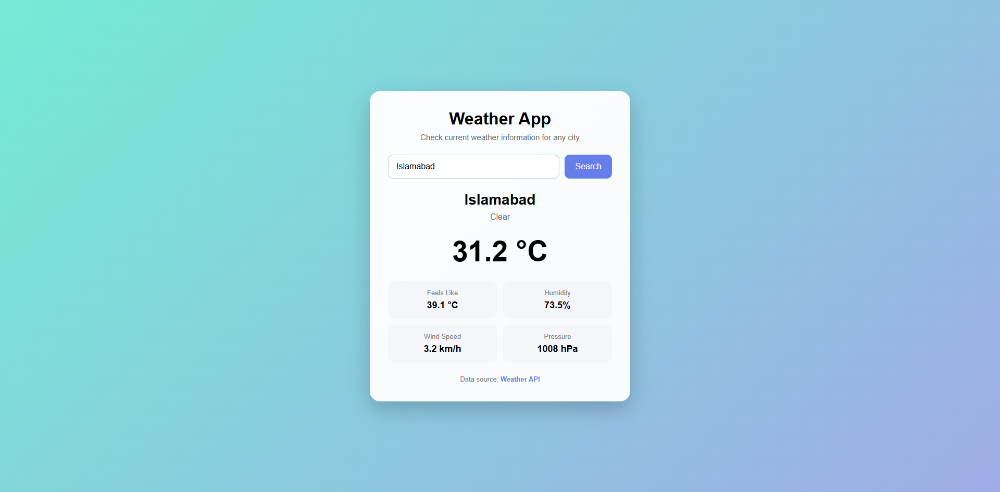

# Weather API

A Django-based Weather API that integrates with the Visual Crossing Weather API to retrieve weather information for any city.

The project also uses Redis caching to reduce repeated requests to the external weather service and includes a simple frontend for displaying weather information in a user-friendly interface.

## Features

* Get weather information by city
* Integration with Visual Crossing Weather API
* Redis caching with a 10-minute cache duration
* JSON API responses
* API error handling
* Request timeout handling
* Secure API key management using `.env`
* Simple HTML/CSS/JavaScript frontend
* Displays weather data from either the API or Redis cache
* Responsive frontend design

# Project URL
* https://roadmap.sh/projects/weather-api-wrapper-service
* Repo Link: https://github.com/Irshadwev/Weather-API
* Get weather information by city: http://127.0.0.1:8000/weather-app/


## Technologies Used

* **Python**
* **Django**
* **Redis**
* **Requests**
* **python-decouple**
* **Visual Crossing Weather API**
* **HTML**
* **CSS**
* **JavaScript**
* **Git & GitHub**

## Project Structure

```text
weather-API/
│
├── manage.py
│
├── weather/
│   ├── settings.py
│   ├── urls.py
│   └── ...
│
├── wapi/
│   ├── templates/
│   │   └── wapi/
│   │       └── weather.html
│   │
│   ├── static/
│   │   └── wapi/
│   │       ├── css/
│   │       │   └── weather.css
│   │       └── js/
│   │           └── weather.js
│   │
│   ├── views.py
│   ├── urls.py
│   └── ...
│
├── screenshots/
│   └── weather-app.png
│
├── .env
├── .gitignore
├── requirements.txt
└── README.md
```

## How It Works

The application follows this flow:

```text
User
  ↓
Weather App Frontend
  ↓
Django Weather API
  ↓
Check Redis Cache
  ↓
 ┌───────────────┐
 │ Cached Data?  │
 └───────┬───────┘
       Yes ↓        No
     Redis        Visual Crossing API
       ↓               ↓
       └───────┬───────┘
               ↓
          JSON Response
               ↓
          Frontend Display
```

When a user searches for a city:

1. The frontend sends a request to the Django API.
2. Django checks Redis for previously cached weather data.
3. If cached data exists, it is returned immediately.
4. If there is no cached data, Django requests the data from Visual Crossing.
5. The successful response is stored in Redis for 10 minutes.
6. Django returns the weather data as JSON.
7. JavaScript displays the data on the frontend.

## API Endpoint

### Get Weather

```http
GET /weather/?city=Lahore
```

### Example Request

```text
/weather/?city=Lahore
```

### Successful Response

```json
{
    "source": "api",
    "data": {
        "resolvedAddress": "Lahore, Punjab, Pakistan",
        "currentConditions": {
            "temp": 28,
            "conditions": "Partially cloudy",
            "feelslike": 29,
            "humidity": 70,
            "windspeed": 10,
            "pressure": 1008
        }
    }
}
```

When the response comes from Redis:

```json
{
    "source": "cache",
    "data": {
        "resolvedAddress": "Lahore, Punjab, Pakistan"
    }
}
```

The actual weather response contains additional information from Visual Crossing.

## Error Handling

The API handles common problems gracefully.

| Situation                            |     Status Code |
| ------------------------------------ | --------------: |
| City not provided                    |           `400` |
| External API HTTP error              | Upstream status |
| Unable to connect to weather service |           `502` |
| Weather API request timeout          |           `504` |

Example:

```json
{
    "error": "City is required."
}
```

Timeout response:

```json
{
    "error": "Weather service request timed out."
}
```

## Redis Caching

Redis is used to cache successful weather responses.

Each city receives a unique cache key:

```text
weather:lahore
```

Cached data is stored for:

```text
600 seconds
```

which is equal to **10 minutes**.

This helps reduce unnecessary requests to the external weather API and improves response time for repeated searches.

The API response also tells the frontend where the data came from:

```json
"source": "cache"
```

or:

```json
"source": "api"
```

## Frontend

The project includes a simple frontend weather application built with:

* HTML
* CSS
* JavaScript

The frontend allows users to:

* Enter a city
* Search for weather information
* View temperature
* View feels-like temperature
* View humidity
* View wind speed
* View pressure
* See the weather description
* See whether the data came from Redis or the external API

### Frontend URL

```text
/weather-app/
```

## Screenshot



## Installation

### 1. Clone the Repository

Clone this repository to your local machine.

### 2. Create a Virtual Environment

```bash
python -m venv venv
```

Activate it on Windows:

```bash
source venv/Scripts/activate
```

### 3. Install Dependencies

```bash
pip install -r requirements.txt
```

### 4. Configure Environment Variables

Create a `.env` file in the project root:

```env
WEATHER_API_KEY=your_visual_crossing_api_key
```

Do **not** commit your `.env` file to GitHub.

### 5. Run Migrations

```bash
python manage.py migrate
```

### 6. Start Redis

Make sure your local Redis server is running on:

```text
localhost:6379
```

### 7. Start Django

```bash
python manage.py runserver
```

## Usage

Open the frontend:

```text
http://127.0.0.1:8000/weather-app/
```

Or test the API directly:

```text
http://127.0.0.1:8000/weather/?city=Lahore
```

You can also test the API using Postman.

## Testing

The API was tested using Postman for:

* Successful weather requests
* Missing city parameter
* Invalid requests
* External API errors
* API response status codes
* Redis cache responses
* Frontend API integration

## Environment Variables

The project keeps sensitive configuration outside the source code.

Example:

```env
WEATHER_API_KEY=your_api_key
```

The `.env` file is excluded from Git using `.gitignore`.

## Future Improvements

Possible future improvements include:

* User authentication
* Weather forecast history
* More detailed weather information
* Rate limiting
* Automated API tests
* Production deployment
* Improved frontend design
* Location-based weather detection

## Author

**Irshad Ahmed**

Backend Developer | Python | Django | REST APIs

## License

This project is intended for learning, portfolio, and demonstration purposes.
